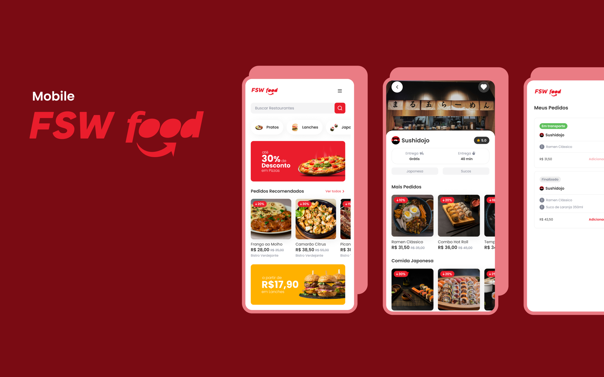

# FSW Foods

FSW Foods is a food delivery application inspired by iFood, a popular food delivery app. It allows users to browse restaurants, view products, add items to a cart, and place orders. Users can also favorite restaurants, view their order history, and enjoy personalized recommendations.

This application is not fully responsive; it was developed with a mobile-first approach and has not been adapted for desktop screens.



---

## 🚀 Features

- **Authentication**: Google OAuth integration using `next-auth`.
- **Restaurant Management**: Browse restaurants, view details, and favorite them.
- **Product Management**: View products, discounts, and complementary items.
- **Cart Management**: Add, update, and remove items from the cart.
- **Order Management**: Place orders, view order history, and reorder past orders.

---

## 🛠️ Technologies Used

- **Framework**: [Next.js](https://nextjs.org/) (App Router)
- **Database**: [Prisma ORM](https://www.prisma.io/) with a PostgreSQL database (using [NeonDB](https://neon.tech/) for hosting)
- **Authentication**: [NextAuth.js](https://next-auth.js.org/) with Google OAuth
- **Styling**: [TailwindCSS](https://tailwindcss.com/) with custom themes
- **UI Components**: [ShadcnUI](https://shadcn.dev/)
- **State Management**: React Context API
- **Linting & Formatting**: ESLint, Prettier, and Husky
- **Deployment**: [Vercel](https://vercel.com/)

---

## 🖥️ Local Setup

Follow these steps to set up the project locally:

### 1. Clone the Repository

```bash
git clone https://github.com/your-username/fsw-foods.git
cd fsw-foods
```

### 2. Install Dependencies

```bash
npm install
```

### 3. Configure Environment Variables
Create a .env file in the root directory and add the following variables:
```bash
# Database
DATABASE_URL=postgresql://<username>:<password>@<host>:<port>/<database>

# Google OAuth
GOOGLE_CLIENT_ID=<your-google-client-id>
GOOGLE_CLIENT_SECRET=<your-google-client-secret>
```

### 4. Set Up the Database
Run the following commands to set up the database:
```bash
# Generate Prisma Client
npx prisma generate

# Run Migrations
npx prisma migrate dev

# Seed the Database
npm run prisma:seed
```

### 5. Start the Development Server
```bash
npm run dev
```
Open http://localhost:3000 in your browser to view the application.

---

## 🌱 Database Seeding
The project includes a seed script to populate the database with initial data. The seed script is located at prisma/seed.ts. To run the seed script, use:
```bash
npm run prisma:seed
```

This will populate the database with sample restaurants, products, categories, and more. 